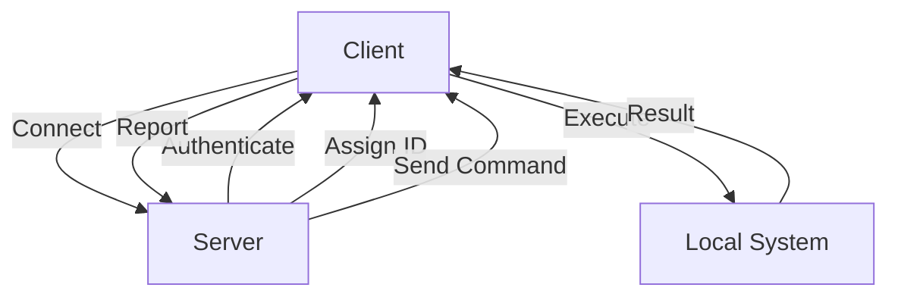

# Empire-Rust Architecture Overview

## System Components

### Core Module
- Defines fundamental data structures and traits
- Implements error handling
- Provides common interfaces for server and client

### Server Module
- Manages agent connections
- Handles command execution
- Maintains task queue
- Implements security measures

### Client Module
- Connects to Empire server
- Executes commands
- Reports results
- Handles reconnection logic

## Communication Flow

1. Client connects to Server
2. Server authenticates Client
3. Server assigns Agent ID
4. Client receives commands
5. Client executes commands
6. Client reports results
7. Server processes results

## Security Architecture

- Encrypted communication channel
- Authentication mechanism
- Command validation
- Input sanitization
- Secure task execution

## Data Flow

## Error Handling

- Connection errors
- Authentication failures
- Command execution errors
- Network issues
- System resource limitations 