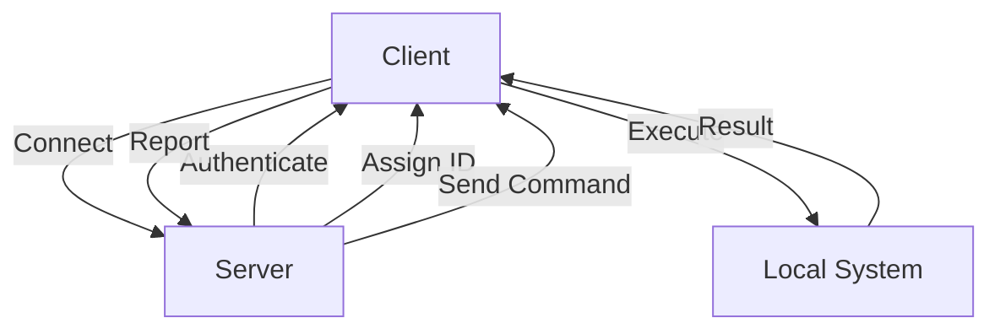

# Empire-Rust Architecture Overview

This document provides a comprehensive overview of the Empire-Rust framework's architecture,
including its components, communication flow, security measures, and error handling.

## System Components

### Core Module
- Defines fundamental data structures and traits
- Implements error handling
- Provides common interfaces for server and client
- Manages message serialization and deserialization
- Handles task status tracking

### Server Module
- Manages agent connections and authentication
- Handles command execution and task distribution
- Maintains task queue and status tracking
- Implements security measures and access control
- Manages file transfers and system information

### Client Module
- Connects to Empire server securely
- Executes commands and reports results
- Handles reconnection logic and heartbeat
- Manages local command execution
- Processes file transfers and system operations

## Communication Flow

1. Client connects to Server
   - Establishes secure connection
   - Initiates authentication process
2. Server authenticates Client
   - Validates credentials
   - Assigns unique agent ID
3. Server assigns Agent ID
   - Creates agent record
   - Sets up communication channel
4. Client receives commands
   - Processes command requests
   - Validates command parameters
5. Client executes commands
   - Runs commands locally
   - Captures output and errors
6. Client reports results
   - Sends execution results
   - Includes success/failure status
7. Server processes results
   - Updates task status
   - Stores command output

## Security Architecture

- Encrypted communication channel
  - TLS/SSL encryption
  - Secure key exchange
- Authentication mechanism
  - Username/password authentication
  - Token-based session management
- Command validation
  - Input sanitization
  - Command whitelisting
- Input sanitization
  - Parameter validation
  - Path traversal prevention
- Secure task execution
  - Process isolation
  - Resource limits

## Data Flow

## Error Handling

The framework implements comprehensive error handling for various scenarios:

- Connection errors
  - Network failures
  - Timeout handling
  - Reconnection logic
- Authentication failures
  - Invalid credentials
  - Session expiration
  - Access denied
- Command execution errors
  - Command not found
  - Permission denied
  - Resource unavailable
- Network issues
  - Connection drops
  - Packet loss
  - Latency problems
- System resource limitations
  - Memory constraints
  - CPU usage limits
  - File system quotas 